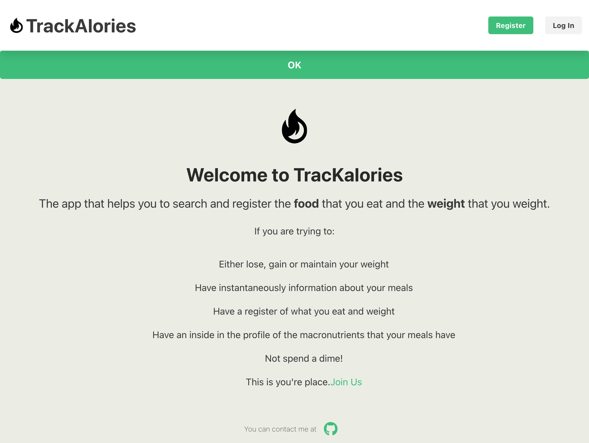

**⚠️ Advertencia**

<p style="font-size: 0.7em;">La funcionalidad de búsqueda <strong>no funciona en producción</strong> en la versión actual del proyecto. Aunque funciona correctamente en el entorno de desarrollo, puede haber problemas o limitaciones en la configuración de producción.
<br>
Por favor, utilice la funcionalidad de búsqueda solo en el entorno de desarrollo hasta que resuelva este problema.</p>

## Trackalories

Trackalories es una aplicación para rastrear la ingesta de calorías. El proyecto consta de un backend desarrollado en Node.js y TypeScript con MongoDB, y un frontend construido con React, TypeScript y Vite, además de ESLint en ambos, ademas en el directorio IA hay una endpoint con una funcionalidad de descripción de imágenes (implementacion de la biblioteca transformers de Xenova).

### Funcionalidades

A continuación se presentan las capturas de pantalla de las diferentes funcionalidades de la aplicación Trackalories:

#### 1. Página de Inicio

La página de inicio muestra una visión general de la aplicación y permite a los usuarios navegar a otras secciones.



#### 2. Página de Diario

Esta es la página principal donde los usuarios pueden ver su diario de comidas. Muestra las entradas de alimentos consumidos y las calorías correspondientes.


#### 3. Página de Inicio de Sesión

Permite a los usuarios autenticarse en la aplicación ingresando sus credenciales.


#### 4. Página Personal

Permite a los usuarios ver y editar su información personal y preferencias.


#### 5. Página de Registro

Permite a los nuevos usuarios registrarse en la aplicación proporcionando la información requerida.


#### 6. Página de Búsqueda

Permite a los usuarios buscar alimentos y agregar entradas a su diario de comidas.


#### 7. Página de seguimiento del peso

Permite a los usuarios introducir el peso diario, ver el registro y un calculo de las calorias segun objetivos


#### 8. Descripcion de imagenes por IA (Funcionalidades extra)

Se elige la imagen o se hace una foto y la funcionalidad describe la imagene para poblar mas facilmente los términos de búsqueda.
Al clicar la palabra que describe la imagen , se popula directamnte la barra de busqueda. Para Desktop y mobile

## 

## Dependencias Obligatorias

- Node.js (v20.15.1)
- npm (v10.2.4)
- MongoDB

### Requisitos Previos

Base de datos MongoDB, node y npm, Api Key del buscador de alimentos.

#### Clonar el Repositorio

Clona el repositorio del proyecto:

```bash
git clone https://github.com/tu-usuario/trackalories.git
cd trackalories
```

#### Configuración del Backend

1. Navega al directorio del backend:

   ```bash
   cd BACKEND
   ```

2. Instala las dependencias del backend:

   ```bash
   npm install
   ```

3. Crea un archivo `.env` en el directorio `BACKEND` con las siguientes variables:

   ```plaintext
   SECRET=your_secret_key
   SALT_ROUNDS=10
   MONGO_URI=mongodb://localhost:27017/your_database
   PORT=3000
   MONGO_URI_TEST=mongodb://localhost:27017/your_test_database
   PORT_TEST=3001
   ```

4. Compila el proyecto backend:

   ```bash
   npm run build
   ```

5. Inicia el servidor backend:

   ```bash
   npm start
   ```

El servidor backend debería estar corriendo en `http://localhost:PORT`.

#### Configuración del Frontend

1. Navega al directorio del frontend:

   ```bash
   cd ../FRONTEND
   ```

2. Instala las dependencias del frontend:

   ```bash
   npm install
   ```

3. Crea un archivo `.env` en el directorio `FRONTEND` con el siguiente contenido:

   ```plaintext
   VITE_API_URL=''
   VITE_API_URL_TEST='http://localhost:5005'
   VITE_NUTRITION_API_URL=your_nutrition_api_url
   VITE_X_APP_ID=your_app_id
   VITE_X_APP_KEY=your_app_key
   VITE_APP_TEST=false
   VITE_PRODUCTION=false
   VITE_API_URL_PRODUCTION=your_production_api_url
   ```

4. Inicia el servidor frontend:

   ```bash
   npm start
   ```

El servidor debería estar corriendo en `http://localhost:PORT`.

#### Configuración de IA

1. Navega al directorio :

   ```bash
   cd IA
   ```

2. Instala las dependencias :

   ```bash
   npm install
   ```

3. Inicia el servidor :

   ```bash
   npm run dev
   ```

### Scripts Disponibles

(Backend y Frontend funcionan independientemente)

#### Backend

- `npm run build`: Compila el proyecto TypeScript en JavaScript.
- `npm start`: Ejecuta el build.
- `npm run dev`: Inicia el servidor en modo desarrollo.
- `npm test`: Ejecuta el servidor en modo de prueba.

#### Frontend

- `npm start`: Inicia el servidor de desarrollo.
- `npm run build`: Compila la aplicación para producción.
- `npm run cypress`: Ejecuta las pruebas e2e.

#### IA

- `npm run dev`: Inicia el servidor en modo desarrollo.

### Contribuciones

Las contribuciones son bienvenidas. Para contribuir:

1. Haz un fork del proyecto.
2. Crea una nueva rama (`git checkout -b feature/nueva-caracteristica`).
3. Realiza tus cambios y haz commits (`git commit -am 'Añadir nueva característica'`).
4. Envía tus cambios (`git push origin feature/nueva-caracteristica`).
5. Abre un Pull Request.

### Licencia

Este proyecto está licenciado bajo la Licencia MIT.

## Créditos

Este proyecto utiliza el paquete [transformers de Xenova](https://github.com/xenova/transformers) para la descripcion de imágenes.

---
